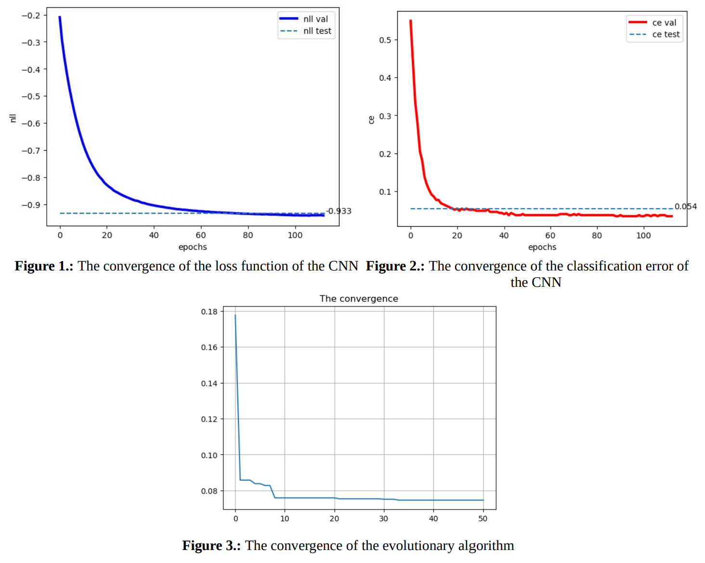

# Neuroevolution: Neural Architecture Search (NAS)

We can formulate the long and daunting process of finding proper parameters for a neural network
as an optimization problem, which we can tackle with the use of evolutionary algorithms. Usually
one approaches setting hyper parameters based on previous experience, intuition and/or
experimentation. While these methodologies can reap an optimal solution, they can be time and
resource consuming.

In this context we tried to find the most optimal set of parameters for a convolutional neural
network (CNN), which classifies handwritten digits. We set the objective function to the
classification error rate on the validation set. However, in order to penalize the algorithm for
choosing larger models, due to the fact that these models usually perform better, but also consume
more time to train and develop. We defined the objective function with the penalization as follows:

<strong> Objective = ClasssificationError + lambda*(Np/Nmax) </strong>

where lambda is a normalization value, for which we binded the value of 0.01, Np is the number of
weights of the CNN that we try to calculate the current objective for and Nmax is the variable
denoting the number of weights of the largest possible CNN, which can be constructed from our
initial hyper parameters. 

### Results

